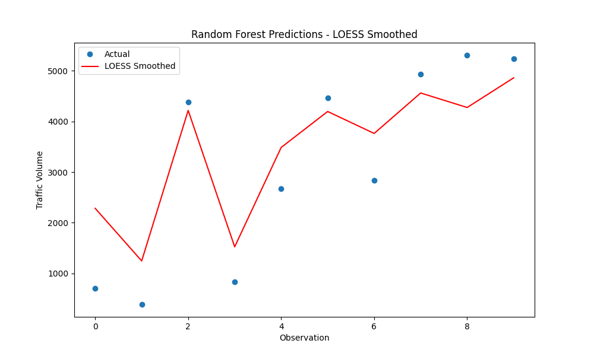

# Project-ABD

## 1. Deskripsi Proyek
Proyek ini bertujuan untuk memprediksi **Traffic Volume** menggunakan pipeline ETL multi-layer (Bronze → Silver → Gold) dan model Machine Learning (Random Forest).  
Pipeline ini memproses data mentah traffic, membersihkan, dan menyiapkan fitur agar model ML dapat menghasilkan prediksi yang akurat.

---

## 2. Pipeline Data
### Bronze Layer
- Load data mentah traffic (`Metro_Interstate_Traffic_Volume.csv`)  
- Konversi kolom waktu ke format timestamp

### Silver Layer
- Preprocessing & feature engineering  
- Agregasi traffic per jam  
- Normalisasi fitur yang diperlukan

### Gold Layer
- Pelatihan model ML (Random Forest)  
- Evaluasi performa model (RMSE, MAE, R², MAPE)  
- Visualisasi prediksi menggunakan LOESS smoothing

---

## 3. Hasil Evaluasi Model
| Model          | RMSE    | MAE    | R²      | MAPE    |
|----------------|---------|--------|---------|---------|
| Random Forest  | 817.70  | 718.61 | 0.8077  | 61.41%  |

**Interpretasi:**  
- Model menjelaskan ~81% variasi traffic per jam (R²=0.8077)  
- Error relatif (MAPE) sekitar 61.41%, cukup realistis untuk data traffic dengan fluktuasi tinggi  
- Model konsisten dan siap digunakan untuk prediksi traffic per jam

---

## 4. Visualisasi Prediksi

**Keterangan Plot:**  
- Titik biru: nilai traffic aktual per jam  
- Garis merah: prediksi Random Forest setelah smoothing LOESS  
- Plot menunjukkan trend prediksi mengikuti pola aktual dengan baik

---

## 5. Kesimpulan
- Random Forest merupakan model terbaik dari pipeline ini  
- Pipeline Bronze → Silver → Gold berhasil menyiapkan data yang bersih dan terstruktur  
- LOESS smoothing membantu visualisasi trend prediksi dengan lebih jelas
